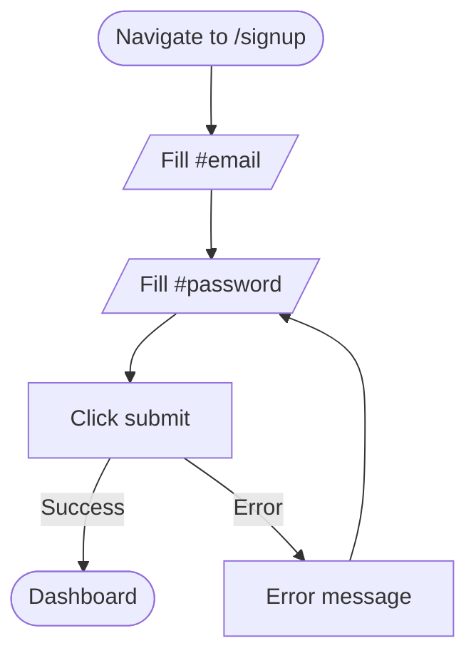
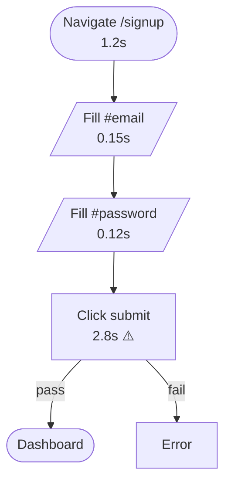
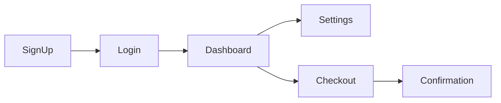

# Flow Diagram

Generate a mermaid flowchart from a flow definition YAML.

## Usage

```
/flow-diagram sign-up
/flow-diagram all          # diagram all flows
```

## Process

### 1. Load Flow

Read `.flowchad/flows/{name}.yml`. Parse steps.

### 2. Build Mermaid Graph

Map each step to a node. Connect sequentially. Add error/alternate paths based on `expect` and `optional` fields.

**Node shapes by action:**
- `navigate` → stadium `([Navigate to /signup])`
- `fill` / `select` → parallelogram `[/Fill #email/]`
- `click` → rectangle `[Click submit]`
- `wait` → circle `((Wait 2s))`
- `hover` / `scroll` → rectangle `[Hover .menu]`

**Edge labels:**
- Steps with `expect` get a success/failure branch
- Steps with `optional: true` get a skip path
- Steps with `captcha: true` get a "→ Navvi" delegation edge

### 3. Generate Output



### 4. Add Timing Annotations

If the flow has been walked (snapshot exists), annotate nodes with actual timing:



### 5. Color Coding (from walk results)

If walk results exist, color nodes by status:
- Pass → default (no style)
- Fail → `style N fill:#f96,stroke:#c33`
- Slow → `style N fill:#ff9,stroke:#cc6`
- Skipped → `style N fill:#ddd,stroke:#999`

### 6. Present Output

Print the mermaid source in a fenced code block. The user can:
- Paste into any mermaid renderer (GitHub, Obsidian, mermaid.live)
- Use `mmdc` CLI to render to PNG/SVG if installed

If multiple flows requested (`all`), generate one diagram per flow with a heading.

## Multi-Flow Overview

When `all` is specified, also generate an overview diagram showing how flows connect:



Derive connections from shared URLs/pages across flows (e.g., sign-up ends at /dashboard, login ends at /dashboard → they converge).
